<div align="center">

<a href="https://github.com/ishandutta2007/Awesome-Awesome-Awesome"></a><a href="https://discord.gg/jc4xtF58Ve"></a>
<a href="https://github.com/ishandutta2007/Awesome-Picture-Archiving-n-Communication-System/stargazers"></a>
<a href="https://github.com/ishandutta2007/Awesome-Picture-Archiving-n-Communication-System/network/members"></a>
<a href="https://github.com/ishandutta2007/Awesome-Picture-Archiving-n-Communication-System/blob/main/LICENSE"></a>
<a href="https://github.com/ishandutta2007"></a>

<br/><br/>



# 🏥 Awesome PACS & Enterprise Medical Imaging Ecosystem 🖼️

**A Curated Directory of SaaS Platforms, Enterprise Solutions & Open-Source DICOM Projects**  
*Covering Medical Image Archiving, DICOMweb, Radiology Workflows, VNA, Zero-Footprint Viewers & Clinical AI Triage*

✨ **Last updated: September 2026** ✨

</div>

---

## 📖 Overview & Ecosystem Landscape

Welcome to the definitive **Picture Archiving and Communication System (PACS)** and **Medical Imaging Informatics** guide. PACS platforms store, retrieve, distribute, visualize, and manage digital medical images and clinical metadata produced across diverse modalities, including:
- 🩻 **Diagnostic Radiology**: CT (Computed Tomography), MRI (Magnetic Resonance Imaging), Digital X-Ray, Mammography / Tomosynthesis
- 🩺 **Point-of-Care & Specialized**: Ultrasound (US), Nuclear Medicine (PET/SPECT), Fluoroscopy, Angiography
- 🔬 **Enterprise Disciplines**: Digital Pathology (WSI), Ophthalmology (OCT), Dermatology, Endoscopy, Cardiology (Hemodynamics/Echo)

Modern healthcare architectures tightly connect PACS with **Radiology Information Systems (RIS)**, **Hospital Information Systems (HIS)**, **Electronic Health Records (EHR/EMR)**, **Vendor Neutral Archives (VNA)**, **DICOMweb APIs (WADO-RS, QIDO-RS, STOW-RS)**, and **Deep Learning AI Inference Pipelines**.

---

## 📑 Table of Contents

- [☁️ SaaS & Commercial Hosted Platforms](#️-saas--commercial-hosted-platforms)
- [💻 Open-Source GitHub Projects](#-open-source-github-projects)
- [🧩 Architectural Blueprints & Frameworks](#-architectural-blueprints--frameworks)
- [🤝 How to Contribute](#-how-to-contribute)
- [📈 Star History](#-star-history)
- [📜 Disclaimer](#-disclaimer)

---

## ☁️ SaaS & Commercial Hosted Platforms

> 📊 **Market Overview & Sector Dynamics:** The global PACS and Enterprise Medical Imaging market is valued at **~$3.8 Billion to $5.2 Billion in 2026** (projected to exceed **$7.5 Billion by 2032** at a ~7.5% CAGR). The market structure is **moderately fragmented**: diversified healthcare conglomerates (*GE HealthCare, Siemens Healthineers, Philips, FUJIFILM, Sectra*) secure large-scale hospital network and IDN contracts, while high-velocity specialized SaaS providers (*Visage Imaging, Intelerad, RamSoft, Aidoc, PostDICOM*) command significant market share in high-speed cloud streaming, outpatient imaging centers, AI triage, and zero-footprint teleradiology.

| 🏢 Platform | 💰 Company Size (Revenue / Valuation) | 📝 Description | 🏷️ Starting Pricing Tier | 🎁 Free Tier / Trial Limits |
| :--- | :--- | :--- | :--- | :--- |
| **[Change Healthcare Enterprise Imaging](https://www.optum.com/)** | ~$370B+ parent revenue (Optum/UnitedHealth Group) / $13B acquisition | Enterprise medical imaging platform supporting image management, workflow integration, visualization, and healthcare interoperability. | Starts at ~$250–$500/user/month (or enterprise agreements starting from ~$30,000+/year) | No free tier; No free trial (solution demonstration and infrastructure assessment upon request) |
| **[Siemens Healthineers Syngo Carbon](https://www.siemens-healthineers.com/)** | ~$23.5B annual revenue / ~$60B market cap (Public: ETR: SHL) | Unified enterprise imaging and workflow platform integrating diagnostic imaging applications, server-side visualization, AI tools, and clinical data. | Starts at ~$350–$700/user/month (or institutional subscriptions starting from ~$50,000+/year) | No free tier; No free trial (guided system demo and clinical trial sandbox upon request) |
| **[FUJIFILM Synapse PACS](https://www.fujifilm.com/)** | ~$20B+ parent revenue (~$7B Healthcare division) | Enterprise medical imaging platform supporting web-based image management, server-side rendering, archiving, workflow efficiency, and EHR integration. | Starts at ~$2.00–$4.00/study (or subscription contracts starting from ~$35,000+/year) | No free tier; No free trial (custom vendor demonstration and site workflow evaluation upon request) |
| **[GE HealthCare Centricity / Enterprise Imaging](https://www.gehealthcare.com/)** | ~$19.6B annual revenue / ~$40B market cap (Public: NASDAQ: GEHC) | Enterprise imaging ecosystem supporting clinical image management, diagnostic visualization, cross-department interoperability, and AI workflows. | Starts at ~$300–$600/user/month (or enterprise deployments starting from ~$50,000+/year) | No free tier; No free trial (guided solution demonstration and clinical architecture consultation upon request) |
| **[Philips IntelliSpace PACS](https://www.usa.philips.com/healthcare/solutions/enterprise-imaging)** | ~$19.5B annual revenue / ~$25B market cap (Public: NYSE: PHG) | Enterprise imaging and PACS ecosystem designed for image management, clinical visualization, workflow integration, radiology operations, and clinical archives. | Starts at ~$200–$500/user/month (or enterprise agreements starting from ~$30,000+/year) | No free tier; No free trial (guided enterprise clinical walkthrough and demonstration available by sales request) |
| **[Carestream Vue PACS](https://www.carestream.com/)** | Part of Philips Enterprise Imaging (~$19.5B parent revenue) | Enterprise imaging and PACS platform supporting radiology image management, clinical visualization, workflow integration, and healthcare interoperability. | Starts at ~$1.50–$3.00/study (or base service tiers starting from ~$20,000/year) | No free tier; No free trial (scheduled live system demonstration upon request) |
| **[Visage Imaging](https://www.visageimaging.com/)** | ~$10B+ market cap / ~$110M annual revenue (Public: ASX: PME) | Enterprise imaging platform focused on high-performance visualization, diagnostic interpretation, server-side rendering, and large-scale healthcare deployments. | Starts at ~$2.00–$3.50/study (or ~$50,000+/year base tier on AWS Marketplace / enterprise licensing) | No free tier; No public free trial (pilot and proof-of-concept sandbox environments available for qualified enterprise health systems) |
| **[Sectra PACS](https://sectra.com/medical/)** | ~$4.5B market cap / ~$250M annual revenue (Public: STO: SECT-B) | Top-ranked enterprise imaging platform supporting radiology, breast imaging, pathology, orthopedics, cardiology, and integrated diagnostic workflows. | Starts at ~$2.00–$3.50/study (or Sectra One SaaS subscriptions from ~$40,000+/year) | No free tier; No public free trial (enterprise clinical evaluation and guided product demo upon request) |
| **[Merge PACS](https://www.ibm.com/products/merge-pacs)** | ~$1B+ valuation / ~$1B revenue (Merative / Francisco Partners) | Enterprise imaging platform supporting DICOM image storage, radiology workflows, clinical image viewing, interoperability, and healthcare imaging operations. | Starts at ~$250–$500/user/month (or ~$25,000+/year base contract for small-to-mid imaging centers) | No free tier; No free trial (interactive live product demonstration available upon request) |
| **[Aidoc](https://www.aidoc.com/)** | ~$1B+ valuation / $140M+ funding (Venture-backed AI unicorn) | AI-driven clinical imaging platform integrating imaging workflows and AI-assisted triage with PACS and enterprise imaging systems. | Starts at ~$50,000/site/year (or ~$6.00/scan/algorithm via AWS Marketplace) | No free tier; No self-service free trial (AI clinical demonstration and feasibility consultation upon request) |
| **[Intelerad](https://www.intelerad.com/)** | ~$1B+ valuation / ~$200M ARR (Acquired by GE HealthCare) | Enterprise medical imaging platform offering PACS, workflow, diagnostic imaging, image sharing, cloud deployment, and radiology operations. | Starts at ~$500/month (base cloud tiers) or ~$25,000–$50,000/year for enterprise departmental deployments | No free tier; No self-service free trial (offers personalized live product demos & clinical workflow consultations upon request) |
| **[Agfa Enterprise Imaging](https://www.agfahealthcare.com/)** | ~$1.2B annual revenue / ~$350M market cap (Public: EBR: AGFB) | Enterprise imaging platform providing PACS, image archiving, clinical workflows, visualization, and enterprise-wide medical imaging management. | Starts at ~$300–$600/user/month (or enterprise contracts from ~$40,000+/year) | No free tier; No free trial (guided enterprise clinical walkthrough and trial sandbox upon request) |
| **[Ambra Health](https://ambrahealth.com/)** | ~$250M acquisition / ~$40M ARR (Intelerad) | Cloud medical-image management and exchange platform supporting image sharing, DICOM workflows, patient imaging access, and enterprise interoperability. | Starts at ~$500/month (or ~$1.50–$2.50/study for cloud image exchange workflows) | No free tier; No free trial (live cloud workflow demo and technical consultation upon request) |
| **[INFINITT PACS](https://www.infinitt.com/)** | ~$150M market cap / ~$80M annual revenue (Public: KOSDAQ: 071200) | Medical imaging and PACS platform supporting DICOM image management, radiology workflow, visualization, enterprise imaging, and clinical interoperability. | Starts at ~$200–$450/user/month (or modular packages starting from ~$15,000/year) | No free tier; No free trial (tailored product demonstration and workflow assessment upon request) |
| **[NovaRad](https://www.novarad.net/)** | ~$30M–$50M estimated annual revenue (Private) | Medical imaging software provider offering PACS, enterprise imaging, visualization, image sharing, radiology workflow, and clinical interoperability solutions. | Starts at ~$1.50–$2.50/study (or ~$15,000/year base deployment tier for small imaging centers) | No free tier; No self-service free trial (custom live product demo & ROI consultation available upon request) |
| **[RamSoft](https://www.ramsoft.com/)** | ~$20M–$40M estimated annual revenue (Private) | Cloud-based radiology and imaging software provider offering PACS, RIS, workflow management, scheduling, reporting, and imaging-center operations. | Starts at ~$1.75/study (or ~$500/month minimum base subscription for PowerServer / OmegaAI) | No free tier; No public free trial (offers 30-minute personalized live interactive demos upon request) |
| **[PaxeraHealth](https://www.paxerahealth.com/)** | ~$15M–$30M estimated annual revenue (Private) | Enterprise imaging platform offering PACS, VNA, AI-enabled workflows, image visualization, and healthcare interoperability. | Starts at ~$250–$450/user/month (or modular cloud tiers starting from ~$12,000/year) | No free tier; No public free trial (personalized live product demo and AI proof-of-concept upon request) |
| **[Aycan](https://www.aycan.com/)** | ~$10M–$20M estimated annual revenue (Private) | Medical imaging software provider offering PACS, image viewing, cloud imaging, workflow, and diagnostic solutions. | Starts at ~$150–$350/month (or base workstation licenses starting from ~$2,500 one-time / subscription) | No free tier; No self-service free trial (custom live demo and evaluation test setup upon request) |
| **[MedDream](https://meddream.com/)** | ~$5M–$10M estimated annual revenue (Private / Softneta) | Medical imaging visualization platform providing web-based DICOM viewing and integration capabilities for PACS, EHR, and clinical applications. | Starts at ~$500–$1,500/license (or ~$100–$200/month for web viewer integration tiers) | 45-day free trial demo license (full diagnostic features for testing & evaluation) + free live online web demo |
| **[PostDICOM](https://www.postdicom.com/)** | ~$3M–$8M estimated annual revenue (Private) | Cloud-based PACS and DICOM viewing platform providing image storage, sharing, web viewing, and remote access capabilities. | Starts at $79.99/month (Essential tier with 100 GB storage) | 7-day free trial (full feature access for any selected plan, credit card required for verification, auto-renews unless cancelled) |

---

## 💻 Open-Source GitHub Projects

*Ranked by GitHub Star Count (Descending)*

* **[nnU-Net](https://github.com/MIC-DKFZ/nnUNet)** [](https://github.com/MIC-DKFZ/nnUNet/stargazers)  
  Highly influential open-source deep-learning framework for biomedical image segmentation, widely utilized for PACS-connected AI triage, organ localization, and volumetric radiology pipelines.

* **[MONAI](https://github.com/Project-MONAI/MONAI)** [](https://github.com/Project-MONAI/MONAI/stargazers)  
  PyTorch-based open-source framework optimized for deep learning in healthcare and medical imaging. Accelerates AI model training, validation, and integration into clinical PACS workflows.

* **[OHIF Viewer](https://github.com/OHIF/Viewers)** [](https://github.com/OHIF/Viewers/stargazers)  
  Leading zero-footprint web-based medical imaging viewer. Connects to DICOMweb endpoints (WADO-RS, QIDO-RS) with 2D/3D MPR, volume rendering, segmentation, structured reporting, and AI overlay extensions.

* **[VTK (Visualization Toolkit)](https://github.com/Kitware/VTK)** [](https://github.com/Kitware/VTK/stargazers)  
  Pioneering open-source 3D computer graphics, image processing, and visualization engine powering diagnostic workstations, volume rendering, and surface extraction across medical software.

* **[TotalSegmentator](https://github.com/wasserth/TotalSegmentator)** [](https://github.com/wasserth/TotalSegmentator/stargazers)  
  Pretrained deep-learning tool for automated anatomical segmentation of over 100 anatomical structures in CT and MRI datasets, readily integrable into PACS AI pipelines.

* **[3D Slicer](https://github.com/Slicer/Slicer)** [](https://github.com/Slicer/Slicer/stargazers)  
  Extensible open-source medical image computing platform for multi-modality visualization, clinical research, image-guided therapy, surgical planning, and quantitative imaging.

* **[TorchIO](https://github.com/TorchIO-project/torchio)** [](https://github.com/TorchIO-project/torchio/stargazers)  
  Open-source Python library designed for efficient loading, preprocessing, augmentation, and patch-based sampling of 3D medical images in deep learning pipelines.

* **[pydicom](https://github.com/pydicom/pydicom)** [](https://github.com/pydicom/pydicom/stargazers)  
  Standard Python library for reading, inspecting, modifying, writing, and anonymizing DICOM files and clinical metadata.

* **[Cornerstone Legacy](https://github.com/cornerstonejs/cornerstone)** [](https://github.com/cornerstonejs/cornerstone/stargazers)  
  Foundational lightweight JavaScript library for displaying interactive medical images in modern HTML5 web browsers.

* **[DWV (DICOM Web Viewer)](https://github.com/ivmartel/dwv)** [](https://github.com/ivmartel/dwv/stargazers)  
  Open-source JavaScript and HTML5 zero-footprint medical viewer library supporting local files, DICOMweb servers, window/level presets, and drawing annotations.

* **[ITK (Insight Segmentation and Registration Toolkit)](https://github.com/InsightSoftwareConsortium/ITK)** [](https://github.com/InsightSoftwareConsortium/ITK/stargazers)  
  Cross-platform open-source library providing an extensive suite of software tools for multi-dimensional image analysis, spatial registration, and segmentation algorithms.

* **[dcm4che](https://github.com/dcm4che/dcm4che)** [](https://github.com/dcm4che/dcm4che/stargazers)  
  High-performance open-source Java framework and command-line toolkit implementing DICOM networking services, message validation, and clinical data manipulation.

* **[QuPath](https://github.com/qupath/qupath)** [](https://github.com/qupath/qupath/stargazers)  
  Leading open-source bioimage analysis platform designed for whole-slide digital pathology, tumor biomarker evaluation, and quantitative tissue microscopy.

* **[Weasis](https://github.com/nroduit/Weasis)** [](https://github.com/nroduit/Weasis/stargazers)  
  Rich desktop and web-integrated clinical DICOM viewer with multi-monitor support, MPR, 3D visualization, measurements, and integration with DICOMweb archives.

* **[CornerstoneJS (Cornerstone3D)](https://github.com/cornerstonejs/cornerstone3D)** [](https://github.com/cornerstonejs/cornerstone3D/stargazers)  
  Next-generation 3D viewport rendering engine for browser-based medical imaging, powering volumetric MPR, 3D volume rendering, and WebGL/WebGPU acceleration.

* **[SimpleITK](https://github.com/SimpleITK/SimpleITK)** [](https://github.com/SimpleITK/SimpleITK/stargazers)  
  Streamlined Python, C++, and Java interface to ITK algorithms for rapid prototyping, image filtering, registration, and segmentation.

* **[DCMTK](https://github.com/DCMTK/dcmtk)** [](https://github.com/DCMTK/dcmtk/stargazers)  
  Reference C/C++ collection of libraries and command-line utilities for DICOM networking, Storage SCP/SCU, PACS querying, and image format conversion.

* **[MITK (Medical Imaging Interaction Toolkit)](https://github.com/MITK/MITK)** [](https://github.com/MITK/MITK/stargazers)  
  C++ software system combining ITK and VTK for interactive medical image processing, surgical robotics, and application development.

* **[NiBabel](https://github.com/nipy/nibabel)** [](https://github.com/nipy/nibabel/stargazers)  
  Python library for reading and writing neuroimaging data formats (NIfTI, Analyze, GIFTI, MINC) and connecting them to DICOM pipelines.

* **[Horos](https://github.com/horosproject/horos)** [](https://github.com/horosproject/horos/stargazers)  
  Free, open-source 64-bit medical image viewer for macOS based on the OsiriX open-source codebase, supporting multi-modality viewing and diagnostic plugins.

* **[Cornerstone Tools](https://github.com/cornerstonejs/cornerstoneTools)** [](https://github.com/cornerstonejs/cornerstoneTools/stargazers)  
  Interactive tool framework providing annotations, zoom/pan, ROI measurements, calipers, and touch-gestures on top of CornerstoneJS viewers.

* **[pynetdicom](https://github.com/pydicom/pynetdicom)** [](https://github.com/pydicom/pynetdicom/stargazers)  
  Pure Python implementation of the DICOM network protocol for implementing Storage SCPs, Query/Retrieve C-FIND, C-MOVE, and modality worklist servers.

* **[Dicoogle](https://github.com/dicoogle/dicoogle)** [](https://github.com/dicoogle/dicoogle/stargazers)  
  Extensible open-source PACS archive and indexing platform designed around plugin-based metadata extraction, Lucene/Elasticsearch querying, and web APIs.

* **[OpenSlide](https://github.com/openslide/openslide)** [](https://github.com/openslide/openslide/stargazers)  
  C library providing a unified interface for reading whole-slide microscopy images (Aperio, Hamamatsu, Leica, Philips, Ventana) into PACS and digital pathology platforms.

* **[DCM4CHEE Archive light](https://github.com/dcm4che/dcm4chee-arc-light)** [](https://github.com/dcm4che/dcm4chee-arc-light/stargazers)  
  Modern enterprise DICOM archive and clinical image management platform supporting DICOMweb, HL7/FHIR feeds, auditing, LDAP security, and Kubernetes deployments.

* **[GDCM (Grassroots DICOM)](https://github.com/malaterre/GDCM)** [](https://github.com/malaterre/GDCM/stargazers)  
  Cross-platform C++ library with Python/C# wrappers for robust parsing, de-identification, and pixel-data decompression (JPEG-LS, JPEG 2000) of complex DICOM files.

* **[Highdicom](https://github.com/ImagingDataCommons/highdicom)** [](https://github.com/ImagingDataCommons/highdicom/stargazers)  
  Python library for high-level DICOM object creation and manipulation, including DICOM Segmentation (SEG), Structured Reports (SR), and Parametric Maps.

* **[DICOMcloud](https://github.com/DICOMcloud/DICOMcloud)** [](https://github.com/DICOMcloud/DICOMcloud/stargazers)  
  Cloud-native open-source DICOMweb server and PACS architecture built with .NET and Azure/AWS cloud storage services.

* **[ITK-Wasm](https://github.com/InsightSoftwareConsortium/ITK-Wasm)** [](https://github.com/InsightSoftwareConsortium/ITK-Wasm/stargazers)  
  WebAssembly & TypeScript bindings for high-performance in-browser medical image computing, pipelines, and DICOM IO.

* **[Orthanc](https://github.com/jodogne/Orthanc)** [](https://github.com/jodogne/Orthanc/stargazers)  
  Lightweight, standalone, and battle-tested open-source DICOM server offering REST APIs, DICOMweb plugins, Lua/Python scripting, and automated image routing.

* **[Conquest DICOM Server](https://github.com/marcelvanherk/Conquest-DICOM-Server)** [](https://github.com/marcelvanherk/Conquest-DICOM-Server/stargazers)  
  Reliable open-source DICOM server supporting multi-database backends (PostgreSQL, MySQL, SQLite), image routing, and DICOM web interfaces.

* **[MONAI Deploy App SDK](https://github.com/Project-MONAI/monai-deploy-app-sdk)** [](https://github.com/Project-MONAI/monai-deploy-app-sdk/stargazers)  
  Framework for packaging and deploying clinical AI applications as standardized Medical Application Packages (MAPs) ready for PACS ingestion.

* **[Orthanc Explorer 2](https://github.com/orthanc-server/orthanc-explorer-2)** [](https://github.com/orthanc-server/orthanc-explorer-2/stargazers)  
  Modern responsive web user interface plugin for Orthanc servers, providing intuitive patient search, study inspection, and viewer launching.

* **[ChRIS Research Integration System](https://github.com/FNNDSC/ChRIS_ultron_backEnd)** [](https://github.com/FNNDSC/ChRIS_ultron_backEnd/stargazers)  
  Scalable open-source distributed platform for medical image computing, cloud-native containerized pipelines, and collaborative imaging research.

---

## 🧩 Architectural Blueprints & Frameworks

```
┌─────────────────────────────────────────────────────────────────────────────┐
│                           MODALITY ACQUISITION                              │
│       [ CT Scanner ]    [ MRI Suite ]    [ X-Ray / US ]    [ Pathology ]    │
└──────────────────────────────────────┬──────────────────────────────────────┘
                                       │ DICOM C-STORE
                                       ▼
┌─────────────────────────────────────────────────────────────────────────────┐
│                          INGESTION & ROUTING TIER                           │
│        • DICOM Routers (DCMTK / pynetdicom / Conquest)                      │
│        • Healthcare Integration Engine (Mirth Connect / Apache Camel)       │
└──────────────────────────────────────┬──────────────────────────────────────┘
                                       │ DICOM / DICOMweb (STOW-RS)
                                       ▼
┌─────────────────────────────────────────────────────────────────────────────┐
│                        ARCHIVE & VNA STORAGE LAYER                          │
│     [ Orthanc Server ]   [ DCM4CHEE Arc Light ]   [ Cloud S3 / Blob VNA ]   │
│             ▲                                      ▲                        │
│             │ REST / Lua Scripting                 │ DICOMweb (QIDO/WADO)   │
└─────────────┼──────────────────────────────────────┼────────────────────────┘
              │                                      │
              ▼                                      ▼
┌───────────────────────────────┐      ┌──────────────────────────────────────┐
│       AI INFERENCE TIER       │      │        DIAGNOSTIC VIEWING TIER       │
│  • MONAI Deploy App SDK       │      │  • OHIF Zero-Footprint Web Viewer    │
│  • nnU-Net / TotalSegmentator │      │  • Weasis Clinical Desktop Viewer    │
│  • Automated Lesion Detection │      │  • Cornerstone3D In-Browser Engine   │
└───────────────────────────────┘      └──────────────────────────────────────┘
```

### Recommended Open-Source Stacks:
1. **Zero-Footprint Cloud PACS**: Combine **Orthanc** or **DCM4CHEE** (Archive Backend) + **OHIF Viewer** (DICOMweb Frontend) + **Keycloak** (OIDC Authentication) + **PostgreSQL** + **MinIO / AWS S3** (Object Storage).
2. **AI-Enabled Teleradiology Pipeline**: Combine **pynetdicom** (Ingestion SCP) + **MONAI / TotalSegmentator** (Inference) + **Highdicom** (DICOM SEG / SR Generation) + **OHIF** (Radiologist Review).
3. **Enterprise Research Repository**: Combine **XNAT** or **ChRIS** + **Dicoogle** (Index Search) + **3D Slicer / Weasis** (Volumetric Measurement).

---

## 🤝 How to Contribute

Contributions from medical imaging informaticists, radiologists, and software developers are warmly welcome!
1. 🍴 **Fork the repository**.
2. ✍️ **Add or edit entries** in `README.md` adhering to the existing formatting and verified data standards.
3. 🔗 **Include links** to official websites or GitHub repositories along with concise, factual descriptions.
4. 🚀 **Submit a Pull Request** with a clear explanation of additions.

---

## 📈 Star History

[](https://star-history.dera.page/#ishandutta2007/Awesome-Picture-Archiving-n-Communication-System&type=date&legend=top-left)

---

## 📜 Disclaimer

* This repository is a **community-curated informational index** — not an official medical endorsement.
* Production medical imaging infrastructure must comply with applicable privacy, cybersecurity, and data protection regulations (**HIPAA, GDPR, PIPEDA, ISO 27001**).
* Diagnostic use and clinical deployment may require compliance with national medical device regulations (**FDA 510(k), CE-MDR, PMDA**).

---

<div align="center">
  <b>Curated with ❤️ for Radiologists, Medical Physicists, PACS Administrators & Healthcare IT Engineers.</b>
</div>
